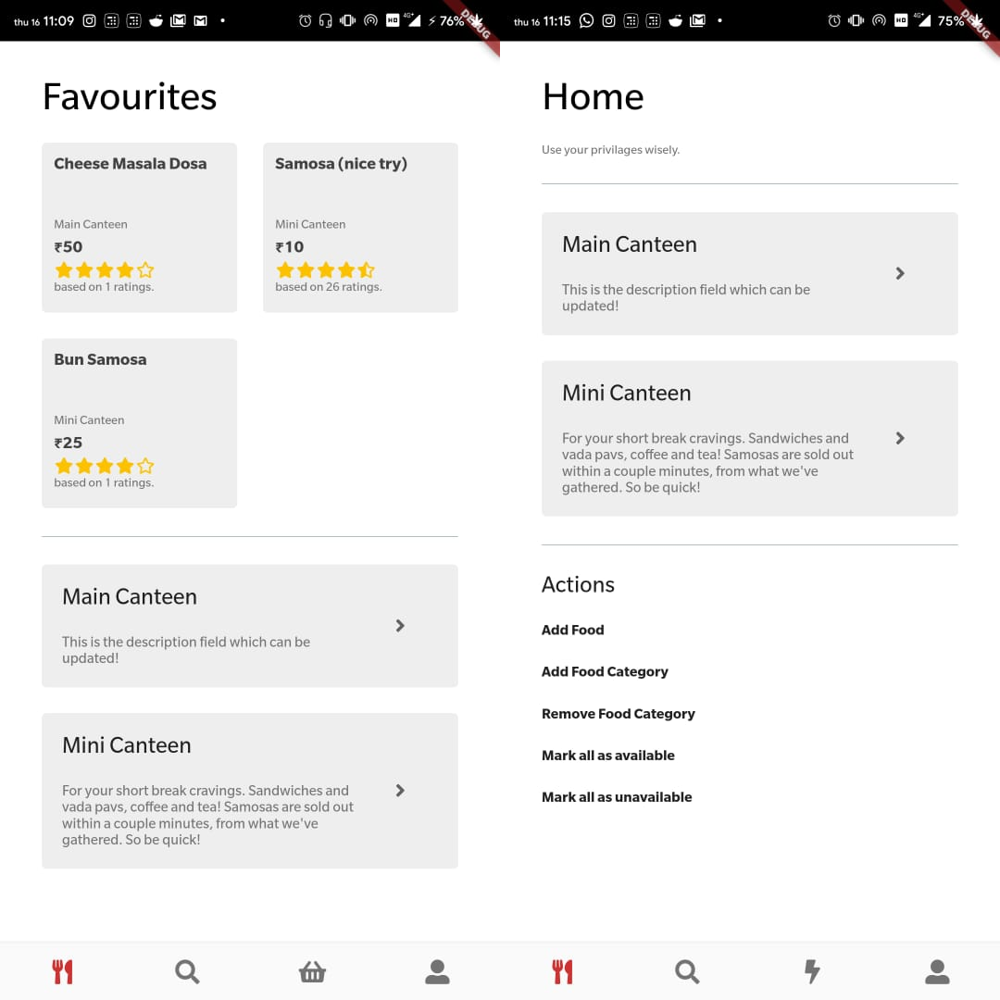

# carvings

A cross platform application for ordering food at RVCE.

## Getting Started

Place these [backend files](https://github.com/29vivek/carvings_backend/) at <localhost_directory>/carvings/  
Import *carvings.sql* into phpMyAdmin and modify *connect.php* accordingly.  
Make an addresses.dart file under carvings/lib/constants/ and specify your IP address for localhost.  
Use that variable in carvings/lib/services/web_service.dart to specify baseURL.  

### Screenshots

